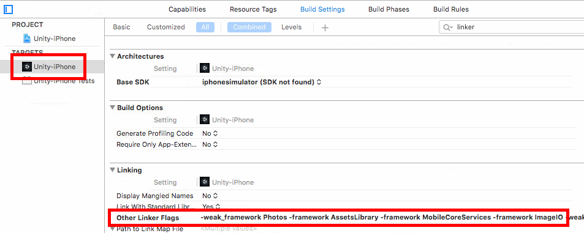

# Unity Native Gallery Plugin
This plugin helps you save your images and/or videos to device **Gallery** on Android and **Photos** on iOS. It only takes a couple of steps to set everything up:

- Import **NativeGallery.unitypackage** to your project
- *for Android*: set **Write Permission** to **External (SDCard)** in **Player Settings**
- *for iOS*: enter a **Photo Library Usage Description** in Xcode


- *for iOS*: also enter a **Photo Library Additions Usage Description**, if exists (see: https://github.com/yasirkula/UnityNativeGallery/issues/3)
- *for iOS*: Insert `-weak_framework Photos -framework AssetsLibrary` to the **Other Linker Flags** of *Unity-iPhone Target* (if your **Deployment Target** is at least 8.0, it is sufficient to insert `-framework Photos`):



- *for iOS*: Lastly, remove *Photos.framework* from **Link Binary With Libraries** of *Unity-iPhone Target* in **Build Phases**, if exists

## Upgrading From Previous Versions
Delete *Plugins/NativeGallery.cs*, *Plugins/Android/NativeGallery.jar* and *Plugins/iOS/NativeGallery.mm* before upgrading the plugin.

## How To
`NativeGallery.SaveImageToGallery( byte[] mediaBytes, string album, string filenameFormatted )`: use this function if you have the raw bytes of the image. 
- On Android, your images are saved at **DCIM/album/filenameFormatted**. On iOS, the image will be saved in the corresponding album
- **filenameFormatted** is string.Format'ed to avoid overwriting the same file on Android, if desired. If, for example, you want your images to be saved in a format like "*My img 1.png*", "*My img 2.png*" and etc., you can set the filenameFormatted as "**My img {0}.png**". *{0}* here is replaced with a unique number to avoid overwriting an existing file. If you don't use a {0} in your filenameFormatted parameter and a file with the same name does exist at that path, the file will be overwritten. On the other hand, a saved image is **never overwritten on iOS**

`NativeGallery.SaveImageToGallery( string existingMediaPath, string album, string filenameFormatted )`: use this function if the image is already saved on disk. Enter the file's path to **existingMediaPath**. The file will be **copied** to **DCIM/album/filenameFormatted** on Android and *temporarily* copied to **Application.persistentDataPath/filenameFormatted** on iOS (copied file will automatically be deleted after saving the image as iOS keeps a separate copy of its media files in its internal directory).

`NativeGallery.SaveImageToGallery( Texture2D image, string album, string filenameFormatted )`: use this function to easily save a **Texture2D** to Gallery/Photos. If filenameFormatted ends with "*.jpeg*" or "*.jpg*", texture will be saved as JPEG; otherwise, it will be saved as PNG.

`NativeGallery.SaveVideoToGallery( byte[] mediaBytes, string album, string filenameFormatted )`: use this function if you have the raw bytes of the video. This function works similar to its *SaveImageToGallery* equivalent.

`NativeGallery.SaveVideoToGallery( string existingMediaPath, string album, string filenameFormatted )`: use this function if the video is already saved on disk. This function works similar to its *SaveImageToGallery* equivalent.

These functions return a *NativeGallery.Permission* value. Details available below.

## About Runtime Permissions
Beginning with *6.0 Marshmallow*, Android apps must request runtime permissions before accessing certain services, similar to iOS. There are two functions to handle permissions with this plugin:

`NativeGallery.Permission NativeGallery.CheckPermission()`: checks whether the app has access to Gallery/Photos or not.

**NativeGallery.Permission** is an enum that can take 3 values: 
- **Granted**: we have the permission to access Gallery/Photos
- **ShouldAsk**: we don't have permission yet, but we can ask the user for permission via *RequestPermission* function (see below). On Android, as long as the user doesn't select "Don't ask again" while denying the permission, ShouldAsk is returned
- **Denied**: we don't have permission and we can't ask the user for permission. In this case, user has to give the permission from Settings. This happens when user denies the permission on iOS (can't request permission again on iOS), when user selects "Don't ask again" while denying the permission on Android or when user is not allowed to give that permission (parental controls etc.)

`NativeGallery.Permission NativeGallery.RequestPermission()`: requests permission to access Gallery/Photos from the user and returns the result. It is recommended to show a brief explanation before asking the permission so that user understands why the permission is needed and doesn't click Deny or worse, "Don't ask again". Note that the SaveImageToGallery/SaveVideoToGallery functions call RequestPermission internally and save the image/video only if the permission is granted (the result of RequestPermission is also returned)

`NativeGallery.OpenSettings()`: opens the settings for this app, from where the user can manually grant permission in case current permission state is *Permission.Denied* (on Android, the necessary permission is named *Storage* and on iOS, the necessary permission is named *Photos*)

`bool NativeGallery.CanOpenSettings()`: on iOS versions prior to 8.0, opening settings from within app is not possible and in this case, this function returns *false*. Otherwise, it returns *true*

## Example Code
The following code captures the screenshot of the game and saves it to Gallery/Photos whenever you tap the screen:
```csharp
void Update()
{
	if( Input.GetMouseButtonDown( 0 ) )
		StartCoroutine( TakeSS() );
}
	
private IEnumerator TakeSS()
{
	yield return new WaitForEndOfFrame();

	Texture2D ss = new Texture2D( Screen.width, Screen.height, TextureFormat.RGB24, false );
	ss.ReadPixels( new Rect( 0, 0, Screen.width, Screen.height ), 0, 0 );
	ss.Apply();

	Debug.Log( "Permission result: " + NativeGallery.SaveImageToGallery( ss, "GalleryTest", "My img {0}.png" ) );
}
```
